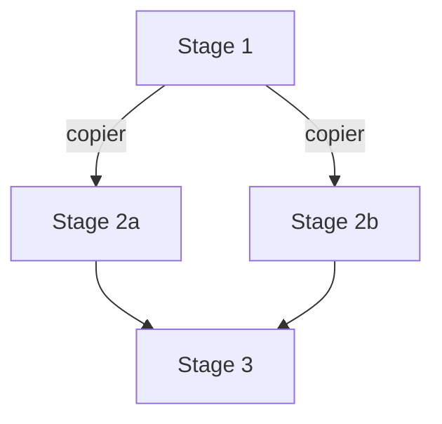
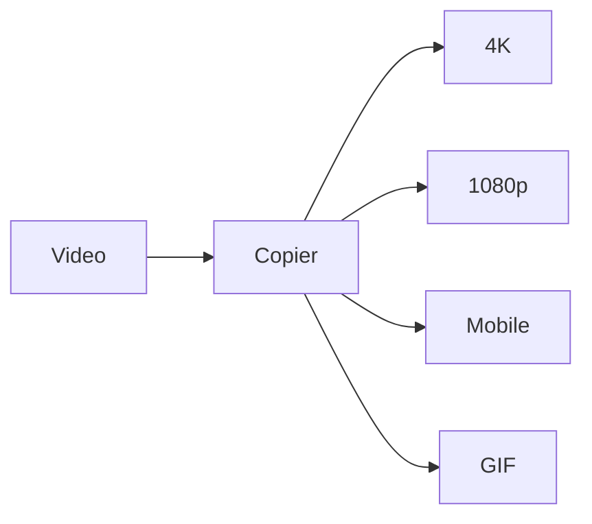
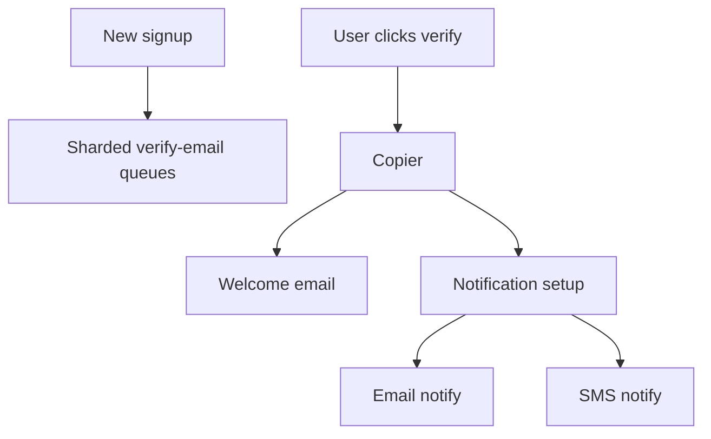

# Event-Driven Batch Processing

> **Adapted from:** Brendan Burns, *Designing Distributed Systems* (O'Reilly), Chapter 12 — rewritten and condensed for teaching.

[Work queues](./work-queue-systems) shine at **one input → one output**. Many batch jobs need **multi-step** flows or **many outputs** from one input. Link queues so one’s completion becomes the next’s event — a **workflow**: work flowing through a **directed acyclic graph (DAG)** of stages.

Without a blueprint of how queues relate, event-driven batch systems become as hard to reason about as sprawling FaaS graphs — especially once errors and retries appear.

---

## Patterns of Event-Driven Processing

Simple chaining (queue A → queue B) is obvious. The patterns below coordinate **multiple** queues or reshape streams.

### Copier

Duplicate one stream into **two or more identical** streams when several independent jobs need the **same** input.

Example: one uploaded video → 4K, 1080p, mobile, and GIF thumbnail queues.

Also useful as a **temporary** reliability/latency hack: process twice and take the first success to dodge rare 60× slowdowns or raise effective reliability (e.g. ~99% → ~99.99% if failures are independent) — better to fix the root cause later, but resources can buy time.

### Filter

Shrink a stream by **dropping** items that fail a predicate.

Example: new signups → keep only users who opted into promo email.

Compose as an **ambassador/adapter** around an existing source: full list in, filtered list out to the generic queue infrastructure.

### Splitter

Like a filter, but **route** every item somewhere — no silent drops. Evaluate criteria; send items to **different** queues.

Example: shipped orders → email-notification queue and/or SMS queue (both if the user chose both).

A splitter can include copy behavior. You *could* build XOR-style routing from a copier + filters, but a splitter names the intent more clearly (like having an XOR gate even though AND/OR/NOT suffice).

### Sharder

A more general splitter: divide work with a **shard function** into roughly even queues.

Why:

- **Reliability / rollouts** — bad worker image hits one shard first (e.g. 1 of 4 → ~25% blast radius).
- **Load spreading** — balance across regions/DCs.

When a shard is unhealthy, routing should **spill** work to remaining healthy shards (including down to one).

### Merger

Opposite of a copier: **many sources → one queue**.

Example: many git repos each produce commit events; merge into one build-and-test queue instead of N parallel CI fleets.

Often a **multi-adapter**: several source containers adapted into one merged ItemList for a shared worker pool.

### Hands On: Route with filter, splitter, and sharder

<CodeExercise
  id="dds-edb-route"
  title="Filter, split, and shard streams"
  heading="exercise-batch-patterns"
  lang="python"
  filename="main.py"
  prompt={`(1) filter_items(items, pred): return items where pred(item) is True (preserve order).

(2) split_notifications(orders): each order is {"id", "email": bool, "sms": bool}.
    Return (email_ids, sms_ids) — an order can appear in both lists.

(3) shard_items(items, num_shards, key_fn): return a list of num_shards lists;
    put each item in shard key_fn(item) % num_shards (preserve relative order within a shard).`}
  sampleLog={`(no input)
[2, 4]
(['a', 'c'], ['a', 'b'])
[['x', 'z'], ['y']]`}
  starter={`def filter_items(items, pred):
    pass

def split_notifications(orders):
    pass

def shard_items(items, num_shards, key_fn):
    pass

print(filter_items([1, 2, 3, 4], lambda x: x % 2 == 0))
email, sms = split_notifications([
    {"id": "a", "email": True, "sms": True},
    {"id": "b", "email": False, "sms": True},
    {"id": "c", "email": True, "sms": False},
])
print((email, sms))
print(shard_items(["x", "y", "z"], 2, lambda s: ord(s)))
`}
  hint="filter: list comprehension. split: append id to email and/or sms lists. shard: buckets = [[] for _ in range(n)]; append to buckets[key_fn(i) % n]."
  solution={`def filter_items(items, pred):
    return [item for item in items if pred(item)]

def split_notifications(orders):
    email_ids = []
    sms_ids = []
    for order in orders:
        if order.get("email"):
            email_ids.append(order["id"])
        if order.get("sms"):
            sms_ids.append(order["id"])
    return (email_ids, sms_ids)

def shard_items(items, num_shards, key_fn):
    buckets = [[] for _ in range(num_shards)]
    for item in items:
        buckets[key_fn(item) % num_shards].append(item)
    return buckets

print(filter_items([1, 2, 3, 4], lambda x: x % 2 == 0))
email, sms = split_notifications([
    {"id": "a", "email": True, "sms": True},
    {"id": "b", "email": False, "sms": True},
    {"id": "c", "email": True, "sms": False},
])
print((email, sms))
print(shard_items(["x", "y", "z"], 2, lambda s: ord(s)))
`}
  sourceChecks={[
    {
      name: 'filter uses pred',
      pattern: 'pred\\s*\\(',
      must: true,
      hint: 'call pred(item) in filter_items',
    },
    {
      name: 'split checks email and sms',
      pattern: '\\[["\']email["\']\\]|\\.get\\(\\s*["\']email',
      must: true,
      hint: 'branch on email and sms flags',
    },
    {
      name: 'shard uses modulo',
      pattern: '%\\s*num_shards',
      must: true,
      hint: 'key_fn(item) % num_shards',
    },
  ]}
  tests={[
    {
      name: 'filter, split, shard',
      stdin: '',
      equals: "[2, 4]\n(['a', 'c'], ['a', 'b'])\n[['x', 'z'], ['y']]",
    },
  ]}
/>

### Check: workflow patterns

<MultipleChoice
  id="dds-edb-patterns"
  title="Batch workflow patterns"
  questions={[
    {
      prompt: 'How does a splitter differ from a filter?',
      choices: [
        'Splitters only drop items; filters only duplicate them',
        'Filters drop non-matching items; splitters route every item to one or more destination queues by criteria',
        'They are identical',
        'Splitters require Kafka; filters forbid HTTP',
      ],
      answer: 1,
      why: 'Filters shrink streams; splitters partition (and may copy) without discarding by default.',
    },
    {
      prompt: 'Why shard a signup email workflow across geographic failure zones?',
      choices: [
        'So emails never need verification',
        'So infra failure or a bad staged rollout only hits a fraction of users, and healthy shards can absorb spillover',
        'Because mergers cannot send email',
        'Because copiers forbid sharding',
      ],
      answer: 1,
      why: 'Blast-radius control and failover — same theme as serving shards.',
    },
    {
      prompt: 'A merger is most useful when…',
      choices: [
        'You must delete all work items',
        'Many similar sources should feed one shared worker pool (e.g. many repos → one CI queue)',
        'You need infinite TTL locks',
        'Workers cannot read files',
      ],
      answer: 1,
      why: 'Collapse N sources into one scalable queue.',
    },
  ]}
/>

---

## Hands On: New User Signup Workflow

Example funnel:

1. **Verify email** — shard users across failure zones; each shard sends verification mail; stage ends.
2. **On verify event** — **copy** into welcome-email queue and notification-setup queue.
3. Welcome email queue sends mail and exits.
4. Notification path **filters/splits** into email and/or SMS registration queues.

### Hands On: Signup stage planner

<CodeExercise
  id="dds-edb-signup"
  title="Signup: copy then split notify prefs"
  heading="exercise-signup-flow"
  lang="python"
  filename="main.py"
  prompt={`(1) after_verified(user): return ["welcome", "notify"] — the two queues a copier fans out to.

(2) notify_targets(prefs): prefs is {"email": bool, "sms": bool}.
    Return the list of queue names among "notify-email" and "notify-sms" that should run (email first if both).`}
  sampleLog={`(no input)
['welcome', 'notify']
['notify-email', 'notify-sms']
['notify-sms']
[]`}
  starter={`def after_verified(user):
    pass

def notify_targets(prefs):
    pass

print(after_verified({"id": "u1"}))
print(notify_targets({"email": True, "sms": True}))
print(notify_targets({"email": False, "sms": True}))
print(notify_targets({"email": False, "sms": False}))
`}
  hint='after_verified always returns both stage names. notify_targets appends "notify-email" / "notify-sms" when flags are true.'
  solution={`def after_verified(user):
    return ["welcome", "notify"]

def notify_targets(prefs):
    targets = []
    if prefs.get("email"):
        targets.append("notify-email")
    if prefs.get("sms"):
        targets.append("notify-sms")
    return targets

print(after_verified({"id": "u1"}))
print(notify_targets({"email": True, "sms": True}))
print(notify_targets({"email": False, "sms": True}))
print(notify_targets({"email": False, "sms": False}))
`}
  sourceChecks={[
    {
      name: 'copier outputs welcome and notify',
      pattern: 'welcome',
      must: true,
      hint: 'include welcome in after_verified',
    },
    {
      name: 'notify-email queue',
      pattern: 'notify-email',
      must: true,
      hint: 'use notify-email when email pref is set',
    },
  ]}
  tests={[
    {
      name: 'copy and notify split',
      stdin: '',
      equals: "['welcome', 'notify']\n['notify-email', 'notify-sms']\n['notify-sms']\n[]",
    },
  ]}
/>

---

## Publisher/Subscriber Infrastructure

Wiring stages with local directories does not scale past one node; network filesystems add ops pain. Prefer a **pub/sub** service:

- Topics/queues hold messages.
- Publishers write; subscribers consume reliably.
- Each workflow edge is often a topic (e.g. sharder outputs `Photos-1` … `Photos-3`).

Cloud options include Azure Event Grid, AWS SQS, etc.; **Kafka** is a common self-hosted choice on Kubernetes (often via Helm). Create topics with sensible **replication factor** (3 or 5) and **partitions** (upper bound on consumer parallelism).

---

## Resiliency and Performance

Real queues mix **fast and slow** items and face **crashes**. Design for both.

### Work stealing

When one worker’s queue is empty, steal from the **back** of the longest peer queue — shortens the worst line (grocery-store lane change) without racing the head item another worker may already own.

### Errors, priority, and retry

Typical queue semantics:

1. **Claim** message (hidden from others, not deleted).
2. **Complete** to delete permanently.
3. On timeout / crash → message returns for another worker.

Implications:

- Assume **at-least-once** → make handlers **idempotent** (or use locks/[ownership](./ownership-election)).
- **Poison pills** that crash 100% of workers can cascade — track attempt counts and use **exponential backoff**, eventually quarantine.
- After a widespread outage, a huge **retry backlog** delays fresh user work — use a **dual queue**: never-tried vs retry (priority: drain new work alongside retries), generalizing to multi-priority queues for latency goals.

### Hands On: Work steal and poison backoff

<CodeExercise
  id="dds-edb-steal-retry"
  title="Steal from longest queue; poison backoff"
  heading="exercise-steal-retry"
  lang="python"
  filename="main.py"
  prompt={`(1) steal_work(queues): queues is a list of lists (each worker's queue, front at index 0).
    If every queue is empty, return None.
    Otherwise take the LAST item from the longest queue (pop from the back), mutating that queue, and return the item.
    Tie-break: lowest index among equal lengths.

(2) next_timeout(attempts, base=1.0): return base * (2 ** attempts) for exponential backoff.`}
  sampleLog={`(no input)
c
['a', 'b']
['x']
4.0`}
  starter={`def steal_work(queues):
    pass

def next_timeout(attempts, base=1.0):
    pass

qs = [["a", "b", "c"], ["x"], []]
print(steal_work(qs))
print(qs[0])
print(qs[1])
print(next_timeout(2, base=1.0))
`}
  hint="Find max length; on ties pick smallest index; pop() from that list. timeout = base * 2**attempts."
  solution={`def steal_work(queues):
    if not any(queues):
        return None
    best_i = 0
    for i, q in enumerate(queues):
        if len(q) > len(queues[best_i]):
            best_i = i
    if not queues[best_i]:
        return None
    return queues[best_i].pop()

def next_timeout(attempts, base=1.0):
    return base * (2 ** attempts)

qs = [["a", "b", "c"], ["x"], []]
print(steal_work(qs))
print(qs[0])
print(qs[1])
print(next_timeout(2, base=1.0))
`}
  sourceChecks={[
    {
      name: 'pops from back',
      pattern: '\\.pop\\s*\\(\\s*\\)',
      must: true,
      hint: 'use list.pop() with no index to steal from the back',
    },
    {
      name: 'exponential backoff',
      pattern: '2\\s*\\*\\*|\\*\\*\\s*attempts|pow\\s*\\(\\s*2',
      must: true,
      hint: 'base * (2 ** attempts)',
    },
  ]}
  tests={[
    {
      name: 'steal and backoff',
      stdin: '',
      equals: "c\n['a', 'b']\n['x']\n4.0",
    },
  ]}
/>

### Check: resiliency

<MultipleChoice
  id="dds-edb-resiliency"
  title="Work stealing and retries"
  questions={[
    {
      prompt: 'Why steal from the *back* of another worker’s queue?',
      choices: [
        'Back items are always highest priority',
        'Avoid racing the front item another worker may already be processing; still shortens the longest backlog',
        'Kafka only allows pop from the back',
        'Front items are immutable',
      ],
      answer: 1,
      why: 'Safer concurrent claim of not-yet-started work at the tail.',
    },
    {
      prompt: 'Why keep a separate “retry” queue from brand-new work after a mass outage?',
      choices: [
        'Retries are illegal in pub/sub',
        'So fresh user-valuable items are not stuck behind a huge pile of old failed attempts',
        'So copiers stop working',
        'So sharding becomes unnecessary',
      ],
      answer: 1,
      why: 'Priority separation protects latency for new work during recovery.',
    },
    {
      prompt: 'Workers must treat processing as at-least-once because…',
      choices: [
        'Queues never hide messages',
        'A slow worker can still finish after timeout re-delivery, so two workers may handle the same item',
        'Idempotency is forbidden',
        'Pub/sub deletes messages before claim',
      ],
      answer: 1,
      why: 'Visibility timeouts + delayed completions create duplicate delivery windows.',
    },
  ]}
/>

---

:::important Key takeaways
- Event-driven batch **workflows** chain queues into a DAG — blueprint the graph or ops becomes opaque.
- Core patterns: **copier**, **filter**, **splitter**, **sharder**, **merger** (compose freely).
- Wire stages with **pub/sub** (Kafka, cloud queues) rather than brittle shared folders.
- Plan for **skew** (work stealing), **crashes** (claim/complete, idempotency), **poison** (backoff), and **backlogs** (priority / dual queues).
:::

## Further Reading

- Brendan Burns — *Designing Distributed Systems* (O'Reilly), Chapter 12 (Event-Driven Batch Processing)
- [Coordinated Batch Processing](./coordinated-batch-processing) — next: join barriers and reduce after fan-out
- [Work Queue Systems](./work-queue-systems) — single-stage queues this chapter composes
- [Functions and Event-Driven Processing](./functions-and-event-driven-processing) — FaaS relatives of workflow stages
- [Ownership Election](./ownership-election) — locks when duplicate processing is unsafe
- [Sharded Services](./sharded-services) — sharding ideas applied to serving tiers
- [Apache Kafka documentation](https://kafka.apache.org/documentation/) — topics, partitions, and consumer groups
