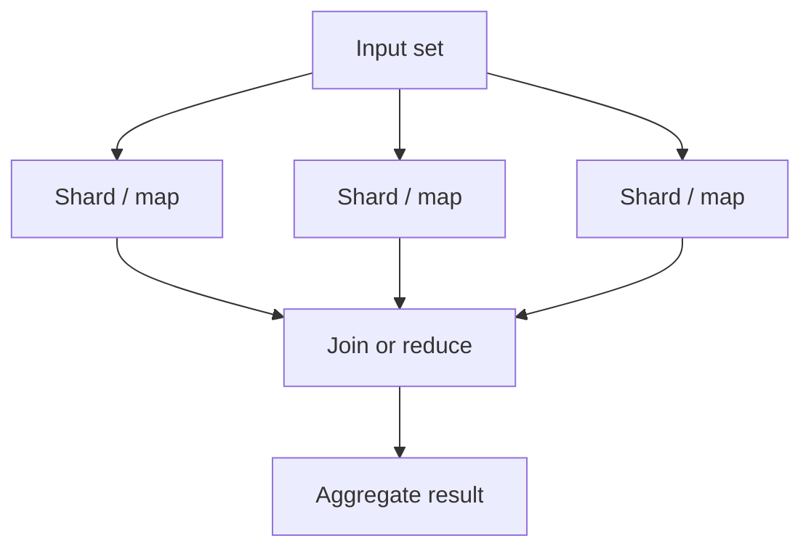
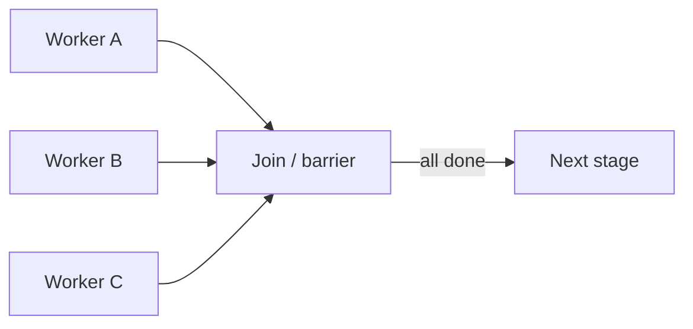
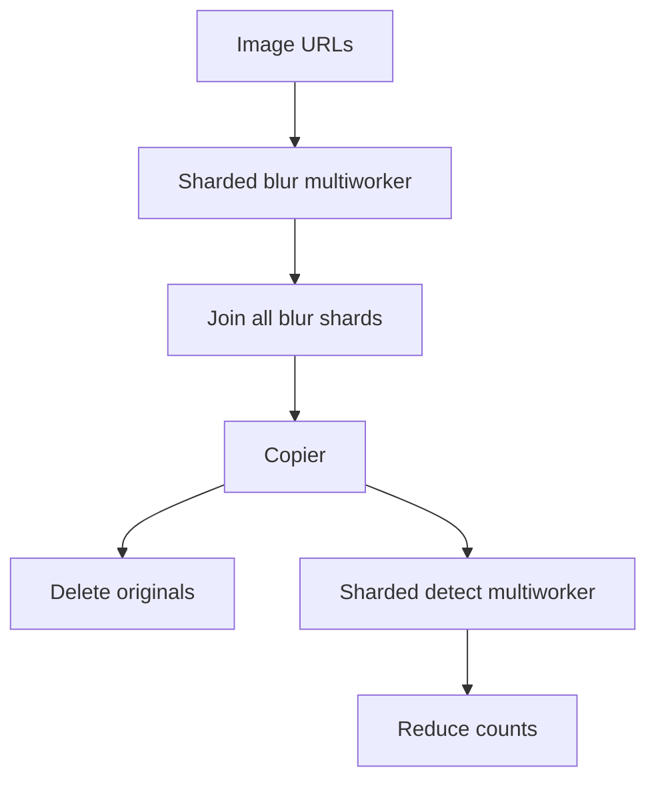

# Coordinated Batch Processing

> **Adapted from:** Brendan Burns, *Designing Distributed Systems* (O'Reilly), Chapter 13 — rewritten and condensed for teaching.

[Event-driven batch](./event-driven-batch-processing) showed how to **split and chain** queues. Many jobs also need to **pull parallel outputs back together** into an aggregate answer — the other half of patterns like MapReduce.



Sharding a work queue is the **map**-like fan-out; this chapter focuses on **coordinated** stages that wait or merge those results.

---

## Join (Barrier Synchronization)

[Merge](./event-driven-batch-processing) blends queues into one stream but does **not** guarantee a **complete** dataset before the next stage. You cannot safely compute globals (sums, “all frames ready”) if items still trickle in.

**Join** (barrier synchronization): parallel work proceeds, but **nothing leaves the join until every expected parallel piece finishes**.

Example: render every film frame independently, then encode one second of video — you need all **30** frames for that second present first.



| Upside | Downside |
|---|---|
| Completeness before aggregation | Less overlapping parallelism → higher end-to-end latency |

Mitigate latency as in earlier chapters: duplicate stragglers / trade compute for time when tail latency dominates.

### Check: join vs merge

<MultipleChoice
  id="dds-cbp-join"
  title="Join barriers"
  questions={[
    {
      prompt: 'When do you need a join instead of a simple merge of queues?',
      choices: [
        'Whenever you use Kafka',
        'When the next stage requires the full parallel set to be present (completeness) before it may run',
        'When you only want to drop odd items',
        'When workers must never finish',
      ],
      answer: 1,
      why: 'Merge mixes streams; join is a barrier for completeness.',
    },
    {
      prompt: 'Main cost of a join barrier is…',
      choices: [
        'It deletes all shard outputs',
        'Subsequent stages wait on the slowest parallel piece, reducing overlap and raising latency',
        'It forbids MapReduce',
        'It requires a singleton forever',
      ],
      answer: 1,
      why: 'Same straggler effect as scatter/gather roots waiting on all leaves.',
    },
  ]}
/>

### Hands On: Frame barrier

<CodeExercise
  id="dds-cbp-join-barrier"
  title="Join: release only when all frames arrive"
  heading="exercise-join"
  lang="python"
  filename="main.py"
  prompt={`(1) join_ready(expected, completed): expected and completed are sets (or lists) of frame ids.
    Return True only when every expected id appears in completed.

(2) frames_for_second(second, fps=30): return the list of frame ids for that second of video.
    Frame ids are integers from second*fps inclusive to (second+1)*fps exclusive.`}
  sampleLog={`(no input)
False
True
[0, 1, 2, 3, 4, 5, 6, 7, 8, 9, 10, 11, 12, 13, 14, 15, 16, 17, 18, 19, 20, 21, 22, 23, 24, 25, 26, 27, 28, 29]
[30, 31, 32, 33, 34, 35, 36, 37, 38, 39, 40, 41, 42, 43, 44, 45, 46, 47, 48, 49, 50, 51, 52, 53, 54, 55, 56, 57, 58, 59]`}
  starter={`def join_ready(expected, completed):
    pass

def frames_for_second(second, fps=30):
    pass

print(join_ready({0, 1, 2}, {0, 1}))
print(join_ready({0, 1, 2}, {2, 0, 1, 9}))
print(frames_for_second(0))
print(frames_for_second(1))
`}
  hint="join_ready: set(expected) <= set(completed). frames_for_second: list(range(second*fps, (second+1)*fps))."
  solution={`def join_ready(expected, completed):
    return set(expected) <= set(completed)

def frames_for_second(second, fps=30):
    return list(range(second * fps, (second + 1) * fps))

print(join_ready({0, 1, 2}, {0, 1}))
print(join_ready({0, 1, 2}, {2, 0, 1, 9}))
print(frames_for_second(0))
print(frames_for_second(1))
`}
  sourceChecks={[
    {
      name: 'subset check',
      pattern: 'set\\s*\\(|<=|issubset|all\\s*\\(',
      must: true,
      hint: 'compare expected vs completed as sets',
    },
    {
      name: 'frame range',
      pattern: 'range\\s*\\(',
      must: true,
      hint: 'use range for consecutive frame ids',
    },
  ]}
  tests={[
    {
      name: 'barrier and frame ranges',
      stdin: '',
      equals: "False\nTrue\n[0, 1, 2, 3, 4, 5, 6, 7, 8, 9, 10, 11, 12, 13, 14, 15, 16, 17, 18, 19, 20, 21, 22, 23, 24, 25, 26, 27, 28, 29]\n[30, 31, 32, 33, 34, 35, 36, 37, 38, 39, 40, 41, 42, 43, 44, 45, 46, 47, 48, 49, 50, 51, 52, 53, 54, 55, 56, 57, 58, 59]",
    },
  ]}
/>

---

## Reduce

If sharding is map-like, **reduce** is the coordinated merge of many parallel outputs into fewer representatives of the answer — without necessarily **blocking** until the entire map finishes.

Each reduce step combines several outputs into one (fewer items; often less payload — only fields needed for the final answer). Because reduce **output looks like reduce input**, you can stack reduce stages until one result remains — and start early while map shards are still running.

Too many reduce layers waste CPU; too few start to look like a single fat join.

### Count (word count)

Shard pages by page-number suffix → each worker emits `{word: count}` → pairwise (or n-way) reduce **sums** counts per word → repeat until one dictionary.

### Sum

Same structure for numeric totals (e.g. US population: shard by state → county → town populations → reduce by adding `(label, value)` pairs). Nested sharding does not change the reduce code if every output is the same shape.

### Histogram

Merge relative histograms by weighting with population (or counts), combining buckets, then renormalizing — again a repeatable reduce.

### Check: reduce vs join

<MultipleChoice
  id="dds-cbp-reduce"
  title="Reduce coordination"
  questions={[
    {
      prompt: 'How does reduce differ from join in a batch pipeline?',
      choices: [
        'Reduce forbids combining any outputs',
        'Reduce optimistically merges partial results into fewer outputs and can start while map shards are still running; join waits for the full set first',
        'Join is always faster than reduce',
        'Reduce only works on video frames',
      ],
      answer: 1,
      why: 'Same associative merge shape lets reduce overlap with map; join is a completeness barrier.',
    },
    {
      prompt: 'Why can the same reduce function run many times in a tree?',
      choices: [
        'Because output shape matches input shape (combine N partials → one partial of the same kind)',
        'Because Kafka forbids joins',
        'Because barriers delete keys',
        'Because shards must share one disk',
      ],
      answer: 0,
      why: 'Associativity / same schema enables stacked or tree-shaped reduce.',
    },
  ]}
/>

### Hands On: Reduce helpers

<CodeExercise
  id="dds-cbp-reduce-helpers"
  title="Reduce: count merge, sum, histogram"
  heading="exercise-reduce"
  lang="python"
  filename="main.py"
  prompt={`(1) merge_counts(a, b): dicts word→int; return a new dict with summed counts for every key in either.
    Iterate keys in sorted order so the printed dict is stable.

(2) merge_sums(pairs): list of (label, value); return (joined_label, total) where joined_label is labels joined by "-" in order.

(3) merge_histograms(h1, pop1, h2, pop2): h1/h2 map bucket→fraction; return bucket→fraction for the combined population.
    Combined count for a bucket is fraction*pop; new fraction is combined_count / (pop1+pop2).
    Include every bucket from either hist; return keys in sorted order.`}
  sampleLog={`(no input)
{'a': 80, 'airplane': 3, 'cat': 2, 'dog': 4, 'the': 42}
('Seattle-Northampton', 4025000)
{'0': 0.175, '1': 0.2}`}
  starter={`def merge_counts(a, b):
    pass

def merge_sums(pairs):
    pass

def merge_histograms(h1, pop1, h2, pop2):
    pass

print(merge_counts(
    {"a": 50, "the": 17, "cat": 2, "airplane": 1},
    {"a": 30, "the": 25, "dog": 4, "airplane": 2},
))
print(merge_sums([("Seattle", 4000000), ("Northampton", 25000)]))
print(merge_histograms({"0": 0.1, "1": 0.2}, 100, {"0": 0.2, "1": 0.2}, 300))
`}
  hint="counts: sorted union of keys, sum a.get+b.get. sums: join labels, sum values. hist: weight each bucket by pop, divide by pop1+pop2."
  solution={`def merge_counts(a, b):
    keys = sorted(set(a) | set(b))
    return {key: a.get(key, 0) + b.get(key, 0) for key in keys}

def merge_sums(pairs):
    labels = [label for label, _ in pairs]
    total = sum(value for _, value in pairs)
    return ("-".join(labels), total)

def merge_histograms(h1, pop1, h2, pop2):
    keys = sorted(set(h1) | set(h2))
    total_pop = pop1 + pop2
    return {
        key: (h1.get(key, 0.0) * pop1 + h2.get(key, 0.0) * pop2) / total_pop
        for key in keys
    }

print(merge_counts(
    {"a": 50, "the": 17, "cat": 2, "airplane": 1},
    {"a": 30, "the": 25, "dog": 4, "airplane": 2},
))
print(merge_sums([("Seattle", 4000000), ("Northampton", 25000)]))
print(merge_histograms({"0": 0.1, "1": 0.2}, 100, {"0": 0.2, "1": 0.2}, 300))
`}
  sourceChecks={[
    {
      name: 'merge_counts adds',
      pattern: '\\.get\\(',
      must: true,
      hint: 'sum overlapping keys in merge_counts',
    },
    {
      name: 'merge_sums joins labels',
      pattern: 'join\\s*\\(',
      must: true,
      hint: 'join labels with "-"',
    },
    {
      name: 'histogram weights by population',
      pattern: 'pop1|pop2',
      must: true,
      hint: 'weight fractions by pop1/pop2',
    },
  ]}
  tests={[
    {
      name: 'count, sum, histogram merges',
      stdin: '',
      equals: "{'a': 80, 'airplane': 3, 'cat': 2, 'dog': 4, 'the': 42}\n('Seattle-Northampton', 4025000)\n{'0': 0.175, '1': 0.2}",
    },
  ]}
/>

---

## Hands On: An Image Tagging and Processing Pipeline

Suppose you have many rush-hour highway photos and want vehicle **type** and **color** counts, after blurring license plates for privacy. Inputs are HTTPS URLs to raw images.

**Stage 1 — blur (sharded multiworker):** one container detects plate boxes; another blurs those regions. Group them with the [multiworker](./work-queue-systems) pattern so each container stays reusable (the blur box API can later anonymize faces in another pipeline). Shard images across queues for throughput and blast-radius control.

**Stage 2 — join:** upload blurred copies, but **do not delete originals** until every shard finished — catastrophic failure may need a full rerun. A **join** holds outputs until all blur shards complete.

**Stage 3 — copier:** after the barrier, [copy](./event-driven-batch-processing) each item to:

- a queue that **deletes** originals
- a queue that **detects** vehicle type and color

**Stage 4 — detect (sharded multiworker again):** shard detection; pair a “locate vehicle type” worker with a “color this region” worker. Separation lets the color container serve other jobs.

Each image emits JSON like:

```json
{
  "vehicles": { "car": 12, "truck": 7, "motorcycle": 4 },
  "colors": { "white": 8, "black": 3, "blue": 6, "red": 6 }
}
```

**Stage 5 — reduce:** tree-reduce those partials (same idea as word count) until one aggregate remains.



### Check: pipeline composition

<MultipleChoice
  id="dds-cbp-pipeline"
  title="Image pipeline patterns"
  questions={[
    {
      prompt: 'Why join after sharded blurring before deleting originals?',
      choices: [
        'Joins make images sharper',
        'So a failed pipeline can still rerun from untouched originals; delete only after every blur shard succeeded',
        'Because reduce cannot sum integers',
        'Because copiers require empty disks',
      ],
      answer: 1,
      why: 'Completeness barrier protects recovery before destructive cleanup.',
    },
    {
      prompt: 'Why split plate detection and blur (or type and color) into separate containers in one multiworker group?',
      choices: [
        'Kubernetes forbids two processes',
        'Reuse: the same blur/color container can serve other pipelines with a small shared API',
        'So joins become optional forever',
        'So sharding is illegal',
      ],
      answer: 1,
      why: 'Separation of concerns enables container reuse across workflows.',
    },
  ]}
/>

### Hands On: Aggregate vehicle stats

<CodeExercise
  id="dds-cbp-vehicle-reduce"
  title="Reduce image vehicle and color counts"
  heading="exercise-vehicles"
  lang="python"
  filename="main.py"
  prompt={`merge_image_stats(a, b): each arg is {"vehicles": {type: count}, "colors": {color: count}}.
Return a new dict with the same shape, summing every nested key from either side.
Sort vehicle and color keys so printed output is stable.`}
  sampleLog={`(no input)
{'vehicles': {'car': 15, 'motorcycle': 5, 'truck': 9}, 'colors': {'black': 5, 'blue': 8, 'red': 7, 'white': 11}}`}
  starter={`def merge_image_stats(a, b):
    pass

print(merge_image_stats(
    {
        "vehicles": {"car": 12, "truck": 7, "motorcycle": 4},
        "colors": {"white": 8, "black": 3, "blue": 6, "red": 6},
    },
    {
        "vehicles": {"car": 3, "truck": 2, "motorcycle": 1},
        "colors": {"white": 3, "black": 2, "blue": 2, "red": 1},
    },
))
`}
  hint="Write a helper that merges two int-dicts with sorted keys; call it for vehicles and colors."
  solution={`def _merge_counts(a, b):
    keys = sorted(set(a) | set(b))
    return {key: a.get(key, 0) + b.get(key, 0) for key in keys}

def merge_image_stats(a, b):
    return {
        "vehicles": _merge_counts(a["vehicles"], b["vehicles"]),
        "colors": _merge_counts(a["colors"], b["colors"]),
    }

print(merge_image_stats(
    {
        "vehicles": {"car": 12, "truck": 7, "motorcycle": 4},
        "colors": {"white": 8, "black": 3, "blue": 6, "red": 6},
    },
    {
        "vehicles": {"car": 3, "truck": 2, "motorcycle": 1},
        "colors": {"white": 3, "black": 2, "blue": 2, "red": 1},
    },
))
`}
  sourceChecks={[
    {
      name: 'merge both sections',
      pattern: 'vehicles|colors',
      must: true,
      hint: 'merge both vehicles and colors nests',
    },
    {
      name: 'sum counts',
      pattern: '\\+|sum\\s*\\(',
      must: true,
      hint: 'add matching counts',
    },
  ]}
  tests={[
    {
      name: 'nested vehicle reduce',
      stdin: '',
      equals: "{'vehicles': {'car': 15, 'motorcycle': 5, 'truck': 9}, 'colors': {'black': 5, 'blue': 8, 'red': 7, 'white': 11}}",
    },
  ]}
/>

---

:::important Key takeaways
- Coordinated batch **joins** act as **barriers** — wait for a complete parallel set before the next stage (completeness over overlap).
- **Reduce** merges partials into fewer outputs of the same shape; it can start early and stack until one aggregate remains (count, sum, histogram).
- Real pipelines compose earlier patterns: **shard**, **multiworker**, **join**, **copier**, then **reduce** — e.g. blur → barrier → delete+detect → aggregate stats.
- Join raises latency (stragglers); reduce trades careful associativity for more parallelism.
:::

## Further Reading

- Brendan Burns — *Designing Distributed Systems* (O'Reilly), Chapter 13 (Coordinated Batch Processing)
- [Monitoring and Observability Patterns](./monitoring-and-observability) — next: logs, metrics, alerts, and traces for reliable services
- [Event-Driven Batch Processing](./event-driven-batch-processing) — copier, sharder, merger, and workflow DAGs this chapter coordinates
- [Work Queue Systems](./work-queue-systems) — multiworker groups reused in the image pipeline
- [Scatter/Gather](./scatter-gather) — related fan-out / fan-in latency trade-offs
- [Sharded Services](./sharded-services) — sharding ideas on the serving side
- [MapReduce: Simplified Data Processing on Large Clusters](https://research.google/pubs/pub62/) — classic map/reduce paper
