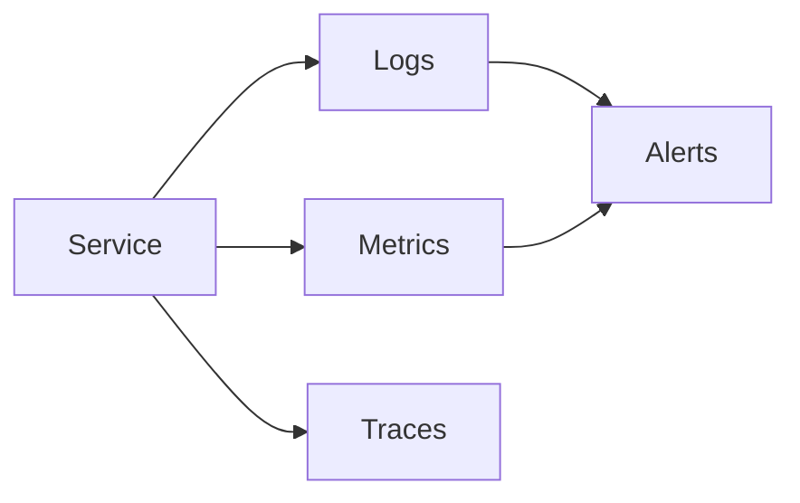
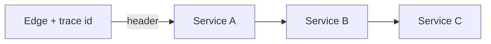

# Monitoring and Observability Patterns

> **Adapted from:** Brendan Burns, *Designing Distributed Systems* (O'Reilly), Chapter 14 — rewritten and condensed for teaching.

Services run **24/7** across time zones. Reliability means noticing problems **before** customers do — and having enough signal to understand *why*. Four building blocks show up in almost every observability stack:

| Concept | Role |
|---|---|
| **Logging** | One execution / one place in code |
| **Metrics** | Aggregates over many requests over time |
| **Alerting** | Rules that interrupt you when something crosses a line |
| **Tracing** | Rebuild one user request across many services |

---

## Logging

At heart, logging is still “something happened here with this data” — `printf` with better manners. Volume is the enemy: useful while debugging a hot component; spam during healthy steady state (and expensive to store/search).

Libraries usually add:

- **Timestamps** — order and deltas between lines
- **Request context** — thread / user / request IDs so parallel work is separable
- **Levels** — filter noise without deleting code paths

Typical levels:

| Level | Use |
|---|---|
| Debug | Verbose; on only when investigating |
| Info | Normal operational breadcrumbs |
| Warning | Concerning but not fatal |
| Error | Something bad; someone should look soon |
| Fatal | Unrecoverable; process exits after the line |

Default runtime level is often **Info** or **Warning**; flip **Debug** on for a class/component when an incident needs detail (**conditional logging**). Be careful: turning on heavy debug for every request can *cause* the next outage via latency.

What to log: errors/exceptions almost always; “weird” cases (a path that took 30s); not a play-by-play of every function. Ask: *what would I wish I had logged when debugging the hardest bug in this code?*

### Check: logging

<MultipleChoice
  id="dds-obs-logging"
  title="Logging practices"
  questions={[
    {
      prompt: 'How do logs differ from metrics?',
      choices: [
        'Logs are always cheaper to store than metrics',
        'Logs describe specific executions; metrics summarize behavior across many requests over time',
        'Metrics replace logging entirely',
        'Logs cannot include timestamps',
      ],
      answer: 1,
      why: 'Per-execution narrative vs aggregate time series.',
    },
    {
      prompt: 'Why use leveled logging instead of printing everything at one severity?',
      choices: [
        'So Fatal never runs',
        'Keep detailed Debug in code but filter it out in production until you need it',
        'Because Info logs cannot include request IDs',
        'Because Kubernetes forbids Error logs',
      ],
      answer: 1,
      why: 'Levels separate “always on” signal from investigatory detail.',
    },
  ]}
/>

### Hands On: Leveled log filter

<CodeExercise
  id="dds-obs-log-level"
  title="Filter log lines by minimum level"
  heading="exercise-log-level"
  lang="python"
  filename="main.py"
  prompt={`LEVELS maps name→rank: DEBUG=10, INFO=20, WARNING=30, ERROR=40, FATAL=50.

(1) should_emit(line_level, min_level): both are level name strings (uppercase).
    Return True if the line's rank is >= the minimum configured rank.

(2) filter_logs(lines, min_level): each line is "LEVEL|message".
    Return only messages (the part after "|") for lines that should emit.`}
  sampleLog={`(no input)
False
True
['started', 'boom']`}
  starter={`LEVELS = {
    "DEBUG": 10,
    "INFO": 20,
    "WARNING": 30,
    "ERROR": 40,
    "FATAL": 50,
}

def should_emit(line_level, min_level):
    pass

def filter_logs(lines, min_level):
    pass

print(should_emit("DEBUG", "INFO"))
print(should_emit("ERROR", "WARNING"))
print(filter_logs(
    ["DEBUG|peek", "INFO|started", "ERROR|boom", "DEBUG|skip"],
    "INFO",
))
`}
  hint="Compare LEVELS[line_level] to LEVELS[min_level]. Split each line on the first '|'."
  solution={`LEVELS = {
    "DEBUG": 10,
    "INFO": 20,
    "WARNING": 30,
    "ERROR": 40,
    "FATAL": 50,
}

def should_emit(line_level, min_level):
    return LEVELS[line_level] >= LEVELS[min_level]

def filter_logs(lines, min_level):
    out = []
    for line in lines:
        level, message = line.split("|", 1)
        if should_emit(level, min_level):
            out.append(message)
    return out

print(should_emit("DEBUG", "INFO"))
print(should_emit("ERROR", "WARNING"))
print(filter_logs(
    ["DEBUG|peek", "INFO|started", "ERROR|boom", "DEBUG|skip"],
    "INFO",
))
`}
  sourceChecks={[
    {
      name: 'uses LEVELS ranks',
      pattern: 'LEVELS\\s*\\[',
      must: true,
      hint: 'look up ranks in LEVELS',
    },
    {
      name: 'splits level from message',
      pattern: 'split\\s*\\(',
      must: true,
      hint: 'split "LEVEL|message"',
    },
  ]}
  tests={[
    {
      name: 'level filter',
      stdin: '',
      equals: "False\nTrue\n['started', 'boom']",
    },
  ]}
/>

---

## Metrics

Metrics characterize **general** execution as **time series**: instantaneous state and how it changes.

Three useful shapes (Prometheus-style vocabulary):

| Type | Idea | Examples |
|---|---|---|
| **Histogram** | Distribution over an interval | Latency, request/response size |
| **Count** | Monotonic integral | Total requests served |
| **Value (gauge)** | Up and down | CPU %, memory bytes |

Counts often become **rates** (derivative): requests now minus requests one minute ago → requests/minute. Tiny windows (e.g. per-ms) look spiky; **average the rate** over a sensible window.

Prometheus is primarily **pull/scrape**: the server asks apps for the current metric snapshot. Short-lived batch jobs may finish before a scrape — use a **push gateway** so jobs push metrics that Prometheus still scrapes.

### Basic request monitoring

Start with request **count** (interesting as a **rate**), then enrich with **labels** like HTTP status (`200`, `404`, `500`). Labels must be a **small discrete** set — do **not** put raw latency or unbounded customer IDs on a counter label.

**Latency** is its own **histogram** (p50 vs p99 matter). You can still label latency histograms by status class to compare error vs success latency.

### Advanced request monitoring

- Request/response **size** histograms (correlate with slowness; watch growth over time)
- Split **queue wait** vs **processing** latency — scale out vs optimize code
- Coarse geography as a label; fine customer analytics often via **log search** (metrics stay cheap aggregates; logs stay rich)

### Check: metrics

<MultipleChoice
  id="dds-obs-metrics"
  title="Metrics shapes"
  questions={[
    {
      prompt: 'Why is HTTP status a good Prometheus label on a request counter, but raw latency is not?',
      choices: [
        'Latency never matters',
        'Labels need a limited discrete set; latency is continuous with huge cardinality',
        'Prometheus cannot store histograms',
        'Status codes are floats',
      ],
      answer: 1,
      why: 'Cardinality: status ≈ small enum; latency needs a histogram metric.',
    },
    {
      prompt: 'When do you prefer a Prometheus push gateway?',
      choices: [
        'For every always-on web server',
        'For short-lived / batch jobs that may exit before a scrape',
        'Instead of all logging forever',
        'Only for Fatal log lines',
      ],
      answer: 1,
      why: 'Pull fits long-lived targets; push preserves metrics from transient work.',
    },
  ]}
/>

### Hands On: Rates, error ratio, latency buckets

<CodeExercise
  id="dds-obs-metrics-math"
  title="Rate, error ratio, histogram percentile"
  heading="exercise-metrics"
  lang="python"
  filename="main.py"
  prompt={`(1) request_rate(count_now, count_prev, seconds): return (count_now - count_prev) / seconds as float.

(2) error_ratio(by_code): by_code maps status string→count (e.g. "200", "500").
    Return fraction of requests whose code starts with "5". If total is 0, return 0.0.

(3) percentile(sorted_samples, p): sorted_samples is non-empty ascending list of numbers; p in [0, 100].
    Return the value at index floor((len-1) * p / 100).`}
  sampleLog={`(no input)
2.0
0.1
120`}
  starter={`def request_rate(count_now, count_prev, seconds):
    pass

def error_ratio(by_code):
    pass

def percentile(sorted_samples, p):
    pass

print(request_rate(120, 100, 10))
print(error_ratio({"200": 90, "404": 0, "500": 10}))
print(percentile([50, 80, 100, 120, 200], 75))
`}
  hint="error_ratio: sum 5xx / sum all. percentile: int((len-1) * p / 100) as index."
  solution={`def request_rate(count_now, count_prev, seconds):
    return (count_now - count_prev) / seconds

def error_ratio(by_code):
    total = sum(by_code.values())
    if total == 0:
        return 0.0
    errors = sum(count for code, count in by_code.items() if str(code).startswith("5"))
    return errors / total

def percentile(sorted_samples, p):
    index = int((len(sorted_samples) - 1) * p / 100)
    return sorted_samples[index]

print(request_rate(120, 100, 10))
print(error_ratio({"200": 90, "404": 0, "500": 10}))
print(percentile([50, 80, 100, 120, 200], 75))
`}
  sourceChecks={[
    {
      name: 'rate divides by seconds',
      pattern: '/',
      must: true,
      hint: 'divide delta by seconds',
    },
    {
      name: 'detects 5xx',
      pattern: 'startswith\\s*\\(|\\[0\\]',
      must: true,
      hint: 'treat codes starting with 5 as errors',
    },
    {
      name: 'percentile indexes',
      pattern: 'int\\s*\\(',
      must: true,
      hint: 'floor via int(...) for the index',
    },
  ]}
  tests={[
    {
      name: 'rate, errors, p75',
      stdin: '',
      equals: "2.0\n0.1\n120",
    },
  ]}
/>

---

## Alerting

Logs and metrics help **after** you know something is wrong. **Alerting** tells you to look — ideally **before** a customer-reported incident (CRI).

### Basic alerting

Rules on metric queries + **static thresholds**, e.g.:

- p90 latency &gt; 500ms
- HTTP 500s &gt; 1% of requests

Those thresholds effectively encode your **SLO**: what “good enough” means. Tune for users **and** on-call health — constant pages and false alarms cause burnout and ignored pages. Alerting is lifelong maintenance as the system and monitors evolve.

Not every metric needs an alert; many exist only for dashboards and debugging. Application quality still tracks **alert quality**.

### Anomaly detection

Static global thresholds miss **100% outage for 1% of users** while the fleet average looks fine. Anomaly / per-cohort detection is harder but increasingly necessary as systems grow.

### Check: alerting

<MultipleChoice
  id="dds-obs-alerting"
  title="Alert design"
  questions={[
    {
      prompt: 'Why treat alert thresholds as tied to SLOs?',
      choices: [
        'Because Prometheus cannot graph rates',
        'They define the boundary between nominal and exceptional operation you are willing to notice',
        'Because logs cannot trigger pages',
        'Because tracing replaces SLOs',
      ],
      answer: 1,
      why: 'What you page on is what you operationally commit to.',
    },
    {
      prompt: 'A static 1% error-rate alert can miss which failure mode?',
      choices: [
        'Any 500 at all',
        'Total failure for a small user cohort while the global error rate stays under the threshold',
        'High CPU on a single idle box',
        'Missing Debug logs',
      ],
      answer: 1,
      why: 'Global averages hide localized black holes — anomaly/cohort alerting helps.',
    },
  ]}
/>

### Hands On: Should we page?

<CodeExercise
  id="dds-obs-alert-rules"
  title="Evaluate simple SLO alert rules"
  heading="exercise-alerts"
  lang="python"
  filename="main.py"
  prompt={`evaluate_alerts(stats, rules):
  stats has keys "p90_ms" (float) and "error_ratio" (float 0..1).
  rules is a list of {"name": str, "metric": "p90_ms"|"error_ratio", "op": ">", "threshold": number}.
  Return the list of rule names that currently fire (condition true), in the same order as rules.`}
  sampleLog={`(no input)
['slow', 'errors']
[]`}
  starter={`def evaluate_alerts(stats, rules):
    pass

rules = [
    {"name": "slow", "metric": "p90_ms", "op": ">", "threshold": 500},
    {"name": "errors", "metric": "error_ratio", "op": ">", "threshold": 0.01},
]
print(evaluate_alerts({"p90_ms": 600, "error_ratio": 0.02}, rules))
print(evaluate_alerts({"p90_ms": 200, "error_ratio": 0.0}, rules))
`}
  hint='Only ">" is required. Append rule["name"] when stats[rule["metric"]] > rule["threshold"].'
  solution={`def evaluate_alerts(stats, rules):
    firing = []
    for rule in rules:
        value = stats[rule["metric"]]
        if rule["op"] == ">" and value > rule["threshold"]:
            firing.append(rule["name"])
    return firing

rules = [
    {"name": "slow", "metric": "p90_ms", "op": ">", "threshold": 500},
    {"name": "errors", "metric": "error_ratio", "op": ">", "threshold": 0.01},
]
print(evaluate_alerts({"p90_ms": 600, "error_ratio": 0.02}, rules))
print(evaluate_alerts({"p90_ms": 200, "error_ratio": 0.0}, rules))
`}
  sourceChecks={[
    {
      name: 'iterates rules',
      pattern: 'for ',
      must: true,
      hint: 'loop over rules',
    },
    {
      name: 'compares threshold',
      pattern: '>',
      must: true,
      hint: 'compare metric value to threshold',
    },
  ]}
  tests={[
    {
      name: 'alert evaluation',
      stdin: '',
      equals: "['slow', 'errors']\n[]",
    },
  ]}
/>

---

## Tracing

Per-service logs and metrics show **all** traffic mixed together. **Tracing** reconstructs **one** user request across microservices.

Practical approach:

1. Mint a **correlation / trace ID** at the edge (random large ID, or hash of stable request traits).
2. Attach it to every log/metric emission.
3. Propagate it on outbound calls (e.g. HTTP header `x-my-apps-correlation-id`) into each service’s request context.

Prefer **[OpenTelemetry](https://opentelemetry.io/)** SDKs and backends over a one-off home-grown stack — vendor-agnostic instrumentation is already a solved community problem.

### Check: tracing

<MultipleChoice
  id="dds-obs-tracing"
  title="Distributed tracing"
  questions={[
    {
      prompt: 'What problem does a correlation ID solve that per-service metrics alone do not?',
      choices: [
        'Counting total requests forever',
        'Stitching one user journey across many services instead of seeing unrelated concurrent RPCs',
        'Replacing all histograms',
        'Deleting Error logs',
      ],
      answer: 1,
      why: 'End-to-end context across the call graph.',
    },
    {
      prompt: 'Why prefer OpenTelemetry over inventing your own tracing library?',
      choices: [
        'It forbids metrics',
        'Language SDKs, vendor-agnostic export, and ecosystem tooling already exist',
        'It removes the need for alert thresholds',
        'It only works offline',
      ],
      answer: 1,
      why: 'Heavy lifting and interoperability are community-owned.',
    },
  ]}
/>

### Hands On: Propagate and group by trace

<CodeExercise
  id="dds-obs-trace-id"
  title="Correlation IDs on hops"
  heading="exercise-trace"
  lang="python"
  filename="main.py"
  prompt={`(1) ensure_trace_id(headers): if headers already has "x-trace-id", return it; else return "gen-" + headers.get("x-request-path", "unknown").

(2) with_trace(headers, outbound): return a new dict that is outbound plus "x-trace-id" set from ensure_trace_id(headers).

(3) group_by_trace(events): events are {"trace_id": str, "service": str}.
    Return dict trace_id → list of service names in encounter order.`}
  sampleLog={`(no input)
abc-1
{'method': 'GET', 'x-trace-id': 'gen-/api'}
{'t1': ['gateway', 'users'], 't2': ['gateway']}`}
  starter={`def ensure_trace_id(headers):
    pass

def with_trace(headers, outbound):
    pass

def group_by_trace(events):
    pass

print(ensure_trace_id({"x-trace-id": "abc-1", "x-request-path": "/x"}))
print(with_trace({"x-request-path": "/api"}, {"method": "GET"}))
print(group_by_trace([
    {"trace_id": "t1", "service": "gateway"},
    {"trace_id": "t2", "service": "gateway"},
    {"trace_id": "t1", "service": "users"},
]))
`}
  hint='ensure_trace_id: headers.get("x-trace-id") or "gen-" + path. with_trace: copy outbound and set the header. group_by_trace: append into dict of lists.'
  solution={`def ensure_trace_id(headers):
    if "x-trace-id" in headers:
        return headers["x-trace-id"]
    return "gen-" + headers.get("x-request-path", "unknown")

def with_trace(headers, outbound):
    out = dict(outbound)
    out["x-trace-id"] = ensure_trace_id(headers)
    return out

def group_by_trace(events):
    grouped = {}
    for event in events:
        grouped.setdefault(event["trace_id"], []).append(event["service"])
    return grouped

print(ensure_trace_id({"x-trace-id": "abc-1", "x-request-path": "/x"}))
print(with_trace({"x-request-path": "/api"}, {"method": "GET"}))
print(group_by_trace([
    {"trace_id": "t1", "service": "gateway"},
    {"trace_id": "t2", "service": "gateway"},
    {"trace_id": "t1", "service": "users"},
]))
`}
  sourceChecks={[
    {
      name: 'reads or creates id',
      pattern: 'x-trace-id',
      must: true,
      hint: 'use the x-trace-id header name',
    },
    {
      name: 'groups events',
      pattern: 'setdefault|\\.get\\(',
      must: true,
      hint: 'accumulate services per trace_id',
    },
  ]}
  tests={[
    {
      name: 'trace propagation and grouping',
      stdin: '',
      equals: "abc-1\n{'method': 'GET', 'x-trace-id': 'gen-/api'}\n{'t1': ['gateway', 'users'], 't2': ['gateway']}",
    },
  ]}
/>

---

## Aggregating Information

Observability data grows fast. Aggregation (and tiering) keeps it queryable and affordable.

- **Cross-replica log search** — `ktail`-style fan-in, or ship to Elasticsearch / cloud log search
- Prefer **managed** log and metrics services for something this critical
- **Downsample** metrics (e.g. 1s → 1m after a week; store averages not one arbitrary sample)
- For logs: keep errors, sample a fraction, or build app-specific compressions
- **Cold storage** when you need long retention / compliance but rare access — slower queries, lower cost; some SaaS products tier automatically

### Check: aggregation

<MultipleChoice
  id="dds-obs-agg"
  title="Aggregation and retention"
  questions={[
    {
      prompt: 'Why downsample old high-resolution metrics?',
      choices: [
        'To delete all Error logs',
        'Cut storage (e.g. 1s→1m is ~60×) while keeping a useful trend, ideally via averages not one random sample',
        'Because OpenTelemetry forbids histograms',
        'So alerts never fire',
      ],
      answer: 1,
      why: 'Cost/volume control with intentional loss of fine detail.',
    },
    {
      prompt: 'Cold storage for logs is a good fit when…',
      choices: [
        'You need sub-second dashboards forever',
        'You must retain data long-term but query it rarely (compliance), accepting slower access',
        'You want to raise cardinality of every label',
        'Tracing is disabled',
      ],
      answer: 1,
      why: 'Trade query speed for retention cost.',
    },
  ]}
/>

### Hands On: Downsample a time series

<CodeExercise
  id="dds-obs-downsample"
  title="Average buckets for downsampling"
  heading="exercise-downsample"
  lang="python"
  filename="main.py"
  prompt={`downsample(samples, bucket_size): samples is a list of numbers in time order.
Group consecutive values into non-overlapping windows of bucket_size.
Return a list of the average of each full window.
Ignore a trailing partial window if len(samples) is not divisible by bucket_size.
Use float division for averages.`}
  sampleLog={`(no input)
[2.0, 5.0]
[15.0]`}
  starter={`def downsample(samples, bucket_size):
    pass

print(downsample([1, 2, 3, 4, 5, 6], 3))
print(downsample([10, 20, 30], 2))
`}
  hint="for i in range(0, len - len%bucket_size, bucket_size): average samples[i:i+bucket_size]."
  solution={`def downsample(samples, bucket_size):
    usable = len(samples) - (len(samples) % bucket_size)
    out = []
    for i in range(0, usable, bucket_size):
        window = samples[i : i + bucket_size]
        out.append(sum(window) / bucket_size)
    return out

print(downsample([1, 2, 3, 4, 5, 6], 3))
print(downsample([10, 20, 30], 2))
`}
  sourceChecks={[
    {
      name: 'averages windows',
      pattern: 'sum\\s*\\(|/',
      must: true,
      hint: 'average each full bucket',
    },
    {
      name: 'steps by bucket_size',
      pattern: 'range\\s*\\(',
      must: true,
      hint: 'walk samples in strides of bucket_size',
    },
  ]}
  tests={[
    {
      name: 'downsample averages',
      stdin: '',
      equals: "[2.0, 5.0]\n[15.0]",
    },
  ]}
/>

---

:::important Key takeaways
- Observability rests on **logs**, **metrics**, **alerts**, and **traces** — each answers a different question.
- Log **levels + context**; metric **histograms / counts / gauges**, labels carefully, pull + push gateway for batch.
- Alerts encode **SLOs**; watch on-call load and cohort blind spots (anomaly detection).
- **Trace IDs** (prefer OpenTelemetry) rebuild one request across services; aggregate and **downsample**/tier storage so signal stays affordable.
:::

## Further Reading

- Brendan Burns — *Designing Distributed Systems* (O'Reilly), Chapter 14 (Monitoring and Observability Patterns)
- [Coordinated Batch Processing](./coordinated-batch-processing) — batch pipelines that still need metrics and push gateways
- [Important Distributed System Concepts](./important-distributed-system-concepts) — SLOs, percentiles, and reliability vocabulary
- [Prometheus documentation](https://prometheus.io/docs/introduction/overview/) — scrape model, metric types, PromQL
- [OpenTelemetry](https://opentelemetry.io/docs/) — vendor-agnostic traces, metrics, and logs
- [Google SRE Book — Monitoring Distributed Systems](https://sre.google/sre-book/monitoring-distributed-systems/) — four golden signals and alerting philosophy
