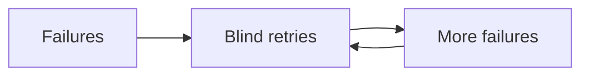
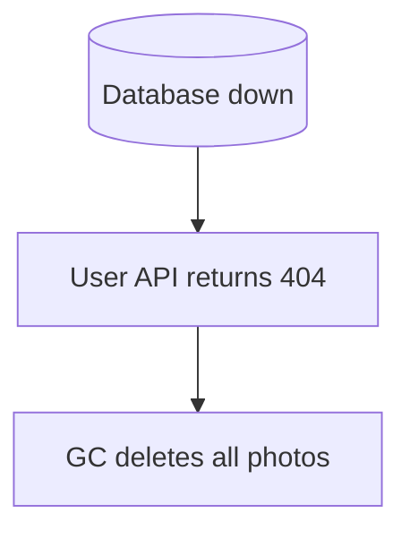

# Common Failure Patterns

> **Adapted from:** Brendan Burns, *Designing Distributed Systems* (O'Reilly), Chapter 16 — rewritten and condensed for teaching.

Earlier chapters covered patterns **to build**. This one is about patterns **to avoid** — recurring mistakes in design and operation. Knowing what fails (and why) is as useful as knowing what to copy.

---

## The Thundering Herd

Capacity is finite. When demand (or retries) exceeds it, users and clients hit reload / retry. Those retries **double** load: new traffic **X** plus the failed **X** becomes **~2X**, then worse — especially with chained RPCs and nested retry loops.

Mitigations on the **client**:

1. **Exponential backoff** — wait longer after each failure (double the delay).
2. **Jitter** — randomize waits so everyone does not wake up together (machines sync; humans are already noisy).
3. **Circuit breaker** — trip when error rates cross a threshold; stop sending for a cool-down.
4. **Gradual recovery** — ramp traffic back in; dumping 100% onto a recovering service often restarts the herd.

### Check: thundering herd

<MultipleChoice
  id="dds-fail-herd"
  title="Retry amplification"
  questions={[
    {
      prompt: 'Why does blind retry under overload often make an outage irrecoverable?',
      choices: [
        'Retries delete circuit breakers',
        'Failed requests return as new load on top of fresh traffic, amplifying X into 2X, 4X, …',
        'Backoff forbids HTTP',
        'Jitter removes all randomness',
      ],
      answer: 1,
      why: 'Retries stack on continuing demand until capacity cannot catch up.',
    },
    {
      prompt: 'Why add jitter to exponential backoff?',
      choices: [
        'So Fatal logs never fire',
        'Without it, many clients wait the same delay and stampede again in lockstep',
        'Because humans never retry',
        'Because circuit breakers cannot trip',
      ],
      answer: 1,
      why: 'Desynchronize recovery attempts across clients.',
    },
  ]}
/>

### Hands On: Backoff with jitter

<CodeExercise
  id="dds-fail-backoff"
  title="Exponential backoff + jitter"
  heading="exercise-backoff"
  lang="python"
  filename="main.py"
  prompt={`(1) backoff_delay(attempt, base=0.1, cap=30.0): return min(cap, base * 2**attempt).
    attempt is 0-based (first retry after failure is attempt 0 → base).

(2) backoff_with_jitter(attempt, base=0.1, cap=30.0, rand=0.5):
    Let d = backoff_delay(...). Return d * (0.5 + rand) so rand in [0,1] scales delay into [0.5d, 1.5d].`}
  sampleLog={`(no input)
0.1
0.4
30.0
0.15
0.6`}
  starter={`def backoff_delay(attempt, base=0.1, cap=30.0):
    pass

def backoff_with_jitter(attempt, base=0.1, cap=30.0, rand=0.5):
    pass

print(backoff_delay(0))
print(backoff_delay(2))
print(backoff_delay(20))
print(backoff_with_jitter(0, rand=1.0))
print(backoff_with_jitter(2, rand=1.0))
`}
  hint="2**attempt for doubling; multiply by (0.5 + rand) after computing delay."
  solution={`def backoff_delay(attempt, base=0.1, cap=30.0):
    return min(cap, base * (2 ** attempt))

def backoff_with_jitter(attempt, base=0.1, cap=30.0, rand=0.5):
    delay = backoff_delay(attempt, base=base, cap=cap)
    return delay * (0.5 + rand)

print(backoff_delay(0))
print(backoff_delay(2))
print(backoff_delay(20))
print(backoff_with_jitter(0, rand=1.0))
print(backoff_with_jitter(2, rand=1.0))
`}
  sourceChecks={[
    {
      name: 'doubles with attempt',
      pattern: '\\*\\*|pow\\s*\\(',
      must: true,
      hint: 'use 2**attempt (or equivalent)',
    },
    {
      name: 'caps delay',
      pattern: 'min\\s*\\(',
      must: true,
      hint: 'cap with min(...)',
    },
    {
      name: 'applies jitter',
      pattern: '0\\.5\\s*\\+|rand',
      must: true,
      hint: 'scale delay by (0.5 + rand)',
    },
  ]}
  tests={[
    {
      name: 'backoff and jitter',
      stdin: '',
      equals: "0.1\n0.4\n30.0\n0.15\n0.6",
    },
  ]}
/>

---

## The Absence of Errors Is an Error

Alerting only on **high** error rates misses the opposite: **zero** traffic / zero errors because nothing is happening.

Example: a subtitle pipeline that only processes uploaded movies. If the uploader loses write permission, uploads stop → processing stops → error rate **0%** — and a “errors &gt; 10%” alert never fires. The service is still broken.

Alert on **too many** errors **and** on **too few** errors / requests (traffic drop).

### Check: silent failure

<MultipleChoice
  id="dds-fail-absence"
  title="Missing traffic"
  questions={[
    {
      prompt: 'Why can a 0% error rate still mean a severe outage?',
      choices: [
        'Zero is always healthy',
        'If work never enters the system, there are no failures to count — ambient errors vanish for the wrong reason',
        'Circuit breakers forbid metrics',
        'Retries delete all counters',
      ],
      answer: 1,
      why: 'No work ⇒ no errors; alert on low request volume too.',
    },
  ]}
/>

---

## “Client” and “Expected” Errors

Invalid client input (bad auth, malformed body) should not count against your SLO the same way as 500s. But “client error” buckets become **dumping grounds**: if *all* users suddenly get 401, that is usually **your** auth bug — not “users being wrong.”

Also run **synthetic** probes you fully control. For those, there should be **no** expected client errors. Pair real-traffic SLOs with synthetic success checks so misclassified errors still page.

### Check: error buckets

<MultipleChoice
  id="dds-fail-client-errors"
  title="Client vs system errors"
  questions={[
    {
      prompt: 'What risk comes from ignoring all 401/403 as “client errors”?',
      choices: [
        'None — auth failures are never your bug',
        'A fleet-wide auth regression can hide inside the “not my problem” bucket without anomaly detection',
        'Synthetics cannot use HTTPS',
        'Jitter stops working',
      ],
      answer: 1,
      why: 'Watch rates and anomalies, not only absolute “server” codes.',
    },
  ]}
/>

### Hands On: Split error classes + traffic floors

<CodeExercise
  id="dds-fail-alert-floors"
  title="High errors, low traffic, auth spike"
  heading="exercise-alert-floors"
  lang="python"
  filename="main.py"
  prompt={`should_alert(stats):
  stats has request_count, server_errors, client_auth_errors (ints), and synthetic_ok (bool).
  Fire (return True) if ANY of:
  - request_count < 10  (too little traffic)
  - server_errors / request_count > 0.1 when request_count > 0
  - client_auth_errors / request_count > 0.5 when request_count > 0  (auth anomaly)
  - synthetic_ok is False
  Otherwise False.`}
  sampleLog={`(no input)
True
True
True
False`}
  starter={`def should_alert(stats):
    pass

print(should_alert({"request_count": 0, "server_errors": 0, "client_auth_errors": 0, "synthetic_ok": True}))
print(should_alert({"request_count": 100, "server_errors": 20, "client_auth_errors": 0, "synthetic_ok": True}))
print(should_alert({"request_count": 100, "server_errors": 0, "client_auth_errors": 80, "synthetic_ok": True}))
print(should_alert({"request_count": 100, "server_errors": 1, "client_auth_errors": 2, "synthetic_ok": True}))
`}
  hint="Guard divisions with request_count > 0. Check the four conditions with or."
  solution={`def should_alert(stats):
    n = stats["request_count"]
    if n < 10:
        return True
    if not stats["synthetic_ok"]:
        return True
    if n > 0 and stats["server_errors"] / n > 0.1:
        return True
    if n > 0 and stats["client_auth_errors"] / n > 0.5:
        return True
    return False

print(should_alert({"request_count": 0, "server_errors": 0, "client_auth_errors": 0, "synthetic_ok": True}))
print(should_alert({"request_count": 100, "server_errors": 20, "client_auth_errors": 0, "synthetic_ok": True}))
print(should_alert({"request_count": 100, "server_errors": 0, "client_auth_errors": 80, "synthetic_ok": True}))
print(should_alert({"request_count": 100, "server_errors": 1, "client_auth_errors": 2, "synthetic_ok": True}))
`}
  sourceChecks={[
    {
      name: 'traffic floor',
      pattern: '<\\s*10|request_count',
      must: true,
      hint: 'alert when request_count is too low',
    },
    {
      name: 'auth anomaly',
      pattern: 'client_auth|0\\.5',
      must: true,
      hint: 'treat high auth-error fraction as alertable',
    },
  ]}
  tests={[
    {
      name: 'alert floors',
      stdin: '',
      equals: "True\nTrue\nTrue\nFalse",
    },
  ]}
/>

---

## Versioning Errors

Clients need a stable **external** API. Internally you want freedom to change memory layout and storage. Keep three versions plus translators:

| Layer | Role |
|---|---|
| **External** | Client-facing wire/API versions (many at once) |
| **Internal** | In-memory / domain model |
| **Storage** | On-disk / DB schema |

Coupling them forces lockstep client + server + DB rollouts — not a decoupled distributed system. Separate versions so you can roll forward/back code without rewriting every client or every stored row at once.

### Check: API versions

<MultipleChoice
  id="dds-fail-versioning"
  title="External vs internal vs storage"
  questions={[
    {
      prompt: 'Why maintain separate external, internal, and storage representations?',
      choices: [
        'So you never need translators',
        'So multiple client API versions and storage migrations can evolve without lockstep updates of every peer',
        'Because HTTP forbids JSON',
        'So thundering herds stop',
      ],
      answer: 1,
      why: 'Translation layers buy decoupling and safer rollouts/rollbacks.',
    },
  ]}
/>

---

## The Myth of Optional Components

Caches (and similar “optional” pieces) start as performance extras. Under growth they become **required** for SLOs — while ops still treats them as disposable. Local in-process caches are especially sneaky: easy to add, hard to size, bad at sharing memory across replicas, and they proliferate.

Treat a new cache like any other permanent architecture change: capacity, reliability, and failure modes included.

### Check: optional caches

<MultipleChoice
  id="dds-fail-optional"
  title="Optional in name only"
  questions={[
    {
      prompt: 'What usually happens to an “optional” cache as load grows?',
      choices: [
        'It stays truly optional forever',
        'The system’s performance goals come to depend on it, but reliability investment often lags',
        'Local caches always use less memory than shared caches',
        'It removes the need for a source of truth',
      ],
      answer: 1,
      why: 'Dependency creeps up; design and ops must match criticality.',
    },
  ]}
/>

---

## Oops, We “Cleaned Up” Everything

Cross-component failure modes delete state at scale. Classic story: GC deletes photos when the user “doesn’t exist.” User API maps DB outage → **404**. GC believes every owner is gone → deletes everything. Backups save the data; trust takes longer.

Humans will mis-map errors across team boundaries. Defense is **systemic**:

- Map dependency failures to **5xx**, not “not found”
- **Throttle** destructive ops (deletes/sec caps)
- **Circuit-break** GC when delete rates spike orders of magnitude above baseline until a human resets

Design for the world where calls return the **wrong** answer, not only the happy path.

### Check: runaway cleanup

<MultipleChoice
  id="dds-fail-cleanup"
  title="Catastrophic deletes"
  questions={[
    {
      prompt: 'Why is returning 404 when the user DB is down dangerous next to a “delete if user missing” GC?',
      choices: [
        '404 is always correct for outages',
        'Every owner looks deleted, so GC can erase the whole corpus',
        'Circuit breakers require 404',
        'Throttles only apply to reads',
      ],
      answer: 1,
      why: 'Distinguish “missing” from “cannot know” — and rate-limit deletes.',
    },
  ]}
/>

### Hands On: GC circuit breaker

<CodeExercise
  id="dds-fail-gc-breaker"
  title="Throttle and trip on delete spikes"
  heading="exercise-gc"
  lang="python"
  filename="main.py"
  prompt={`class DeleteGuard:
  __init__(self, max_per_tick, trip_factor):
    max_per_tick = steady-state delete budget per tick.
    trip_factor = e.g. 10 means trip if requested deletes exceed max_per_tick * trip_factor.

  allow(requested): int → how many deletes may proceed this tick.
    If already tripped, return 0.
    If requested > max_per_tick * trip_factor, trip and return 0.
    Else return min(requested, max_per_tick).

  reset(): clear the tripped flag.`}
  sampleLog={`(no input)
5
0
True
0
5`}
  starter={`class DeleteGuard:
    def __init__(self, max_per_tick, trip_factor):
        pass

    def allow(self, requested):
        pass

    def reset(self):
        pass

g = DeleteGuard(max_per_tick=5, trip_factor=10)
print(g.allow(8))
print(g.allow(1000))
print(g.tripped)
print(g.allow(1))
g.reset()
print(g.allow(5))
`}
  hint="Track self.tripped. Compare requested to max_per_tick * trip_factor before granting min(requested, max_per_tick)."
  solution={`class DeleteGuard:
    def __init__(self, max_per_tick, trip_factor):
        self.max_per_tick = max_per_tick
        self.trip_factor = trip_factor
        self.tripped = False

    def allow(self, requested):
        if self.tripped:
            return 0
        if requested > self.max_per_tick * self.trip_factor:
            self.tripped = True
            return 0
        return min(requested, self.max_per_tick)

    def reset(self):
        self.tripped = False

g = DeleteGuard(max_per_tick=5, trip_factor=10)
print(g.allow(8))
print(g.allow(1000))
print(g.tripped)
print(g.allow(1))
g.reset()
print(g.allow(5))
`}
  sourceChecks={[
    {
      name: 'trips on spike',
      pattern: 'tripped',
      must: true,
      hint: 'keep a tripped flag',
    },
    {
      name: 'throttles steady state',
      pattern: 'min\\s*\\(',
      must: true,
      hint: 'cap deletes with min(requested, max_per_tick)',
    },
  ]}
  tests={[
    {
      name: 'delete guard',
      stdin: '',
      equals: "5\n0\nTrue\n0\n5",
    },
  ]}
/>

---

## Challenges with the Breadth of Inputs

Some bugs hit **100%** for a tiny slice of users — “compiler” problems: infinite legal input space, rare combinations, or fuzzed/malicious payloads (classic SQL injection as the old web example).

Coverage strategies:

1. **Record representative real inputs** — enough time window, regions (e.g. CJK text), and time-of-day variation.
2. **Fuzz** — random (or LLM-generated) valid-shaped inputs for richer APIs.

Together: don’t break yesterday’s users; harden against weird and hostile tomorrow.

### Check: input breadth

<MultipleChoice
  id="dds-fail-inputs"
  title="Rare but sticky bugs"
  questions={[
    {
      prompt: 'Why is recording only North American daytime traffic a weak regression corpus?',
      choices: [
        'Because fuzzing is illegal',
        'Global scripts, locales, and diurnal patterns produce different legal inputs you will never replay',
        'Because 404s cannot be recorded',
        'Because synthetics replace all logs',
      ],
      answer: 1,
      why: 'Representativeness across geography and time matters for coverage.',
    },
  ]}
/>

---

## Processing Obsolete Work

After an outage, a backlog of **abandoned** work (users already reloaded) can keep latency high for hours even after the root cause is fixed — especially if the system runs near capacity.

Recover faster with:

1. **Timeouts** — abort work past a deadline (alone is not enough if each item is just under the timeout).
2. **Scale on latency** — autoscale (or manually surge) on user-facing lag, not only CPU.
3. **Prefer newer work** — triage: drop or deprioritize stale queue items so fresh reloads succeed.

Short outages with fast recovery beat long “fixed but still slow” tails.

### Check: obsolete work

<MultipleChoice
  id="dds-fail-obsolete"
  title="Backlog after recovery"
  questions={[
    {
      prompt: 'Why can a 10-minute outage cause hours of high latency afterward?',
      choices: [
        'Timeouts always equal zero',
        'A near-capacity system slowly drains a backlog of work nobody is waiting for, delaying new requests',
        'Autoscaling forbids latency metrics',
        'Jitter deletes the queue',
      ],
      answer: 1,
      why: 'Shed or deprioritize obsolete work; scale on latency.',
    },
  ]}
/>

### Hands On: Prefer fresh work

<CodeExercise
  id="dds-fail-fresh-work"
  title="Drop stale queue items by age"
  heading="exercise-stale"
  lang="python"
  filename="main.py"
  prompt={`select_work(queue, now, max_age):
  queue is a list of {"id": str, "enqueued_at": number} in arrival order.
  Return ids of items where now - enqueued_at <= max_age, preserving order.
  Items older than max_age are dropped (obsolete).`}
  sampleLog={`(no input)
['b', 'c']`}
  starter={`def select_work(queue, now, max_age):
    pass

print(select_work(
    [
        {"id": "a", "enqueued_at": 0},
        {"id": "b", "enqueued_at": 50},
        {"id": "c", "enqueued_at": 80},
    ],
    now=100,
    max_age=60,
))
`}
  hint="Keep items where now - enqueued_at <= max_age."
  solution={`def select_work(queue, now, max_age):
    return [
        item["id"]
        for item in queue
        if now - item["enqueued_at"] <= max_age
    ]

print(select_work(
    [
        {"id": "a", "enqueued_at": 0},
        {"id": "b", "enqueued_at": 50},
        {"id": "c", "enqueued_at": 80},
    ],
    now=100,
    max_age=60,
))
`}
  sourceChecks={[
    {
      name: 'filters by age',
      pattern: 'enqueued_at|max_age',
      must: true,
      hint: 'compare age to max_age',
    },
  ]}
  tests={[
    {
      name: 'drop stale',
      stdin: '',
      equals: "['b', 'c']",
    },
  ]}
/>

---

## The “Second System” Problem

Seeing debt everywhere tempts a **greenfield rewrite**. New systems feel easier and more fun — until “ready” never arrives.

Why rewrites stall:

- **Feature catch-up** — production keeps shipping; the rewrite trails by months.
- **Mileage debt** — bugs in the new system get it turned off; it never earns production hours.

Better: improve **one microservice at a time**, and invest in **boundaries** (e.g. storage behind an interface) so you can run two implementations side by side without replacing the world.

### Check: second system

<MultipleChoice
  id="dds-fail-second-system"
  title="Rewrite traps"
  questions={[
    {
      prompt: 'Why do full “second systems” often fail to replace production?',
      choices: [
        'Greenfield code cannot have bugs',
        'They trail live feature work and never get enough production exposure before being turned off',
        'Microservices forbid interfaces',
        'Only caches can be rewritten',
      ],
      answer: 1,
      why: 'Catch-up + lack of mileage; prefer incremental replacement.',
    },
  ]}
/>

---

:::important Key takeaways
- **Thundering herd** — backoff + jitter + circuit breakers + gradual recovery; never blind retry storms.
- Alert on **high and low** traffic/errors; don’t hide regressions in “client” buckets; use **synthetics**.
- Separate **external / internal / storage** versions; treat “optional” caches as permanent.
- Guard destructive automation with **throttle + breaker**; shed **obsolete** work after outages.
- Prefer **incremental** service/abstraction rewrites over doomed second systems.
:::

## Further Reading

- Brendan Burns — *Designing Distributed Systems* (O'Reilly), Chapter 16 (Common Failure Patterns)
- [Monitoring and Observability Patterns](./monitoring-and-observability) — alerts, synthetics-friendly metrics, and anomaly gaps
- [Important Distributed System Concepts](./important-distributed-system-concepts) — retries, idempotency, and SLO vocabulary
- [Work Queue Systems](./work-queue-systems) — backlogs, scaling, and multiworker recovery
- [Google SRE Book — Addressing Cascading Failures](https://sre.google/sre-book/addressing-cascading-failures/) — load shedding and overload
